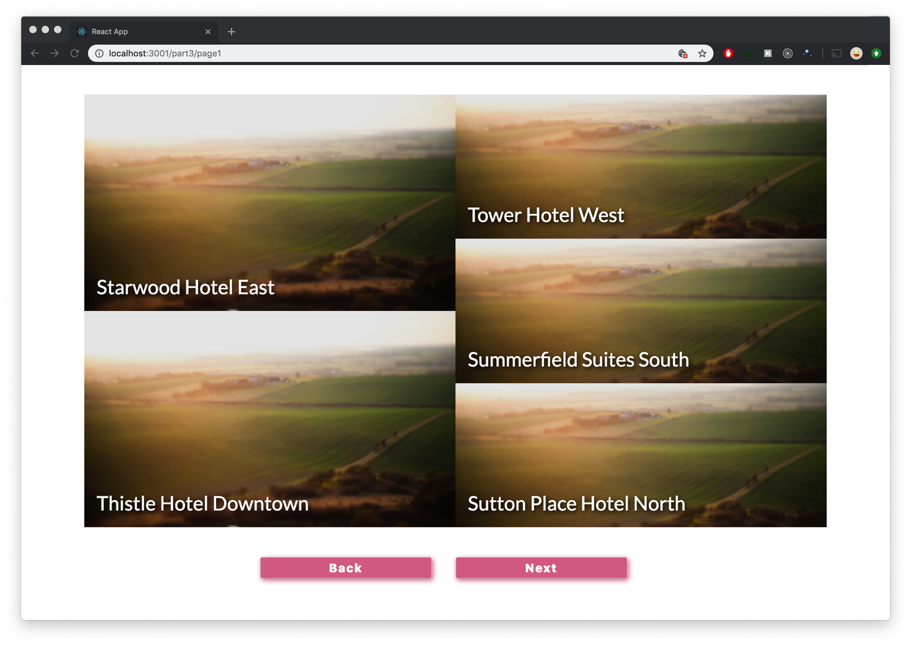

Some practice with

- react
- react-router-dom
- styled-components
- flex-box

👍

# Getting Started

```bash
cd comps-jordan-lee
yarn install
yarn start
```

## Dynamic Page Layout


## Carousel Page Turning with React Router



Welcome to the Simpleview Developer Assessment.

The assessment is in four (4) parts that increase in complexity and scope. You may use any approach you feel comfortable with to complete each section. The assessment period is two (2) days; at the end of the assessment period turn in any and all work including any incomplete work for review.

Although each part builds off the previous, you are expected (unless otherwise directed) to turn in four (4) sets of solutions; one for each part.
